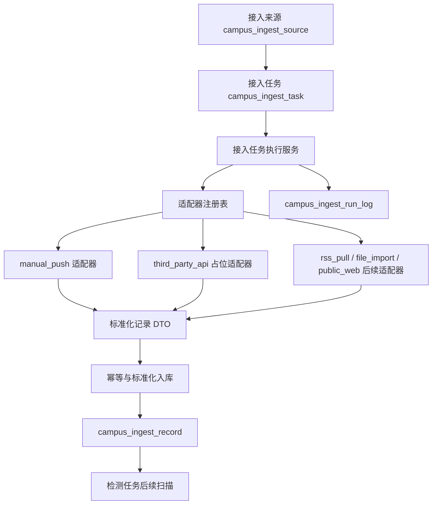

# Batch 21 媒体接入平台基础框架实施方案 V0.2

## 1. 背景

当前系统已有基础数据接入能力：

- `campus_ingest_source`：接入来源。
- `campus_ingest_task`：接入任务。
- `campus_ingest_record`：标准化记录。
- `campus_ingest_run_log`：运行日志。

这些能力已经能支撑人工提交、记录转换、检测扫描，但还没有“真正执行接入任务”的统一执行层：没有适配器 SPI、没有任务运行入口、没有接入执行器、没有显式幂等策略、也没有供应商 API 的安全边界。

V0.1 曾考虑新增独立供应商表和端点表。经过后端、前端、权限审计三个只读子线程摸底后，主线程调整为更保守方案：

```text
Batch 21 先不新增完整供应商/端点体系。
先复用现有 source/task/record/run_log。
把重点放到“可插拔执行骨架 + 手动运行 + 幂等 + 日志闭环”。
```

这样能避免 Batch21 过重，也能让 Batch22 接 TikHub 时直接落在统一执行框架上。

## 2. 本批目标

Batch 21 的目标是建立媒体接入平台的基础执行框架：

- 复用 `campus_ingest_source` 表承载供应商/来源。
- 复用 `campus_ingest_task.fetch_config` 承载端点、请求参数、供应商配置引用。
- 新增接入适配器 SPI。
- 新增适配器注册表。
- 新增任务执行服务。
- 新增手动运行任务接口。
- 运行时写入 `campus_ingest_run_log`。
- 适配器返回数据后标准化写入 `campus_ingest_record`。
- 做最小幂等，避免重复记录炸库。
- 接入审计日志，记录任务运行、配置变更、失败重试。

## 3. 本批明确不做

- 不接入真实 TikHub API Key。
- 不调用真实外部媒体接口。
- 不新增完整 `campus_media_provider` / `campus_media_endpoint` 表。
- 不做完整前端管理页。
- 不做自动调度。
- 不改检测模块扫描逻辑。
- 不自动转线索、转账号动态或转事件。
- 不实现绕登录、验证码、签名、Cookie、设备注册、账号池、代理池能力。
- 不采集私信、通讯录、点赞列表、收藏列表、粉丝/关注列表等非必要数据。
- 不实现评论、点赞、关注、转发、收藏等互动操作。

## 4. 总体架构



## 5. 现有能力复用

### 5.1 后端现有文件

- `CampusIngestController`
- `CampusIngestService`
- `CampusIngestServiceImpl`
- `CampusIngestSourceDao`
- `CampusIngestTaskDao`
- `CampusIngestRecordDao`
- `CampusIngestRunLogDao`
- `CampusIngest*.xml`

### 5.2 前端现有文件

- `campus-web/src/views/IngestView.vue`
- `campus-web/src/services/detectionIngest.ts`
- `campus-web/src/types/api.ts`

### 5.3 复用原则

- 现有“数据接入”页继续保留。
- 现有来源、任务、记录、运行日志接口继续保留。
- 现有字典值不重命名。
- 现有转换线索/账号动态能力不改。
- 现有检测扫描 `ingest_record` 能力不改。

## 6. 数据模型方案

### 6.1 本批不新增供应商和端点表

V0.2 决策：

```text
Batch 21 不新增 campus_media_provider。
Batch 21 不新增 campus_media_endpoint。
```

原因：

- 现有 `campus_ingest_source` 已有来源类型、平台、访问端点、授权依据、授权范围。
- 现有 `campus_ingest_task` 已有适配器类型、计划表达式、fetchConfig、任务状态。
- Batch21 的优先级是执行骨架，不是配置后台大而全。
- 完整供应商/端点前端和配置模型留到 Batch28 或供应商规模扩大后再抽象。

### 6.2 接入来源作为供应商/来源

`campus_ingest_source` 字段映射：

| 现有字段 | Batch21 语义 |
| --- | --- |
| source_name | 供应商或来源名称，如 TikHub、上级平台、学校公众号 |
| source_type | `api`、`rss`、`public_web`、`upper_transfer`、`manual` |
| platform | 平台，如 `douyin`、`weibo`、`xhs` |
| access_endpoint | 基础地址或来源说明 |
| authorization_basis | 授权依据 |
| authorization_scope | 授权范围 |
| enabled | 是否启用 |

### 6.3 接入任务作为端点配置

`campus_ingest_task` 字段映射：

| 现有字段 | Batch21 语义 |
| --- | --- |
| source_id | 所属供应商/来源 |
| target_type | `clue` 或 `account_content` |
| adapter_type | 适配器类型，如 `manual_push`、`third_party_api`、`rss_pull` |
| schedule_cron | 后续 Batch23 调度使用 |
| fetch_config | 端点编码、关键词、分页、供应商配置引用等 JSON |
| task_status | `active`、`paused`、`disabled` |
| authorization_scope | 任务授权范围 |
| retention_days | 记录保留天数 |

### 6.4 fetch_config 建议结构

Batch21 不强制落真实供应商，只定义建议结构：

```json
{
  "provider": "tikhub",
  "endpointCode": "douyin_search_video",
  "contentScope": "search",
  "credentialRef": "TIKHUB_API_KEY",
  "keyword": "学校名称 食堂",
  "maxPage": 1,
  "maxItemsPerRun": 20,
  "dedupeStrategy": "external_id",
  "allowInteraction": false,
  "allowPrivateData": false
}
```

约束：

- `credentialRef` 只能是引用，不能是真实 Key。
- `allowInteraction` 默认必须为 `false`。
- `allowPrivateData` 默认必须为 `false`。
- 真实 API Key 不得进入 `fetch_config`。

### 6.5 是否新增迁移

Batch21 推荐不新增表。是否新增字段分两档：

保守实现：

- 不新增迁移。
- 利用现有唯一键 `(source_id, external_id)` 做最小幂等。

增强实现：

- 新增 `V1.13__CampusIngestExecutionEnhancement.sql`。
- 给 `campus_ingest_record` 增加可空字段：
  - `run_id`：关联本次运行日志业务 ID。
  - `content_hash`：内容哈希，用于没有 externalId 时去重。

主线程建议：Batch21 实施时优先采用增强实现，因为 `run_id` 和 `content_hash` 能显著提升日志闭环和幂等能力，且是可空字段，风险较低。

## 7. 后端技术方案

### 7.1 新增包路径建议

```text
com.stonedt.intelligence.service.campus.ingest
```

建议文件：

- `CampusIngestAdapter`
- `CampusIngestAdapterRegistry`
- `CampusIngestFetchRequest`
- `CampusIngestFetchResult`
- `CampusIngestNormalizedRecord`
- `ManualPushIngestAdapter`
- `UnsupportedIngestAdapter`

### 7.2 Adapter SPI

```java
public interface CampusIngestAdapter {
    String adapterType();

    CampusIngestFetchResult fetch(CampusIngestFetchRequest request);
}
```

适配器类型：

- `manual_push`：本批可实现为空结果或占位。
- `third_party_api`：本批只占位，Batch22 实现 TikHub。
- `rss_pull`：后续实现。
- `file_import`：后续实现。
- `public_web`：后续 Batch27 仅做白名单公开网页。

### 7.3 任务执行服务

建议新增服务：

```java
CampusIngestExecutionService
```

核心方法：

```java
Map<String, Object> runTask(Long taskId, Long operatorUserId);
```

执行流程：

1. 加载接入任务。
2. 加载接入来源。
3. 校验任务未删除、状态允许运行。
4. 校验来源启用。
5. 校验授权依据、授权范围存在。
6. 创建 `campus_ingest_run_log`，状态 `running`。
7. 根据 `adapter_type` 从注册表取适配器。
8. 调用适配器获取标准化记录。
9. 对记录做最小幂等：
   - 优先 `(source_id, external_id)`。
   - 没有 externalId 时使用 `content_hash`。
10. 写入 `campus_ingest_record`。
11. 更新任务 `last_run_time`。
12. 结束 run log，写 success/fail count。
13. 记录审计日志。

### 7.4 Controller 接口

在现有 `CampusIngestController` 增加：

```text
POST /campus/ingest/task/run
```

请求：

```json
{
  "taskId": 200202
}
```

返回：

```json
{
  "runId": 123,
  "runStatus": "success",
  "fetchedCount": 10,
  "successCount": 8,
  "failCount": 2,
  "message": "运行完成"
}
```

### 7.5 DAO / Mapper 影响

可能需要补：

- `CampusIngestTaskDao.findByTaskId`
- `CampusIngestTaskDao.updateLastRunTime`
- `CampusIngestRecordDao.findBySourceAndExternalId`
- `CampusIngestRecordDao.findByContentHash`
- `CampusIngestRecordDao.insert`
- `CampusIngestRunLogDao.startRun`
- `CampusIngestRunLogDao.finishRun`

具体是否已有同名能力，应在实施前再次读代码确认。

## 8. 前端技术方案

Batch21 不做完整前端。

可选最小前端：

- 在现有 `IngestView.vue` 的接入任务表增加“运行”按钮。
- 调用 `POST /campus/ingest/task/run`。
- 成功后刷新运行日志。

不做：

- 不新增“供应商”完整 Tab。
- 不新增“端点”完整 Tab。
- 不重构 `IngestView.vue`。
- 不新建 `/media-ingest` 路由。

完整供应商、端点、任务、日志、合规审核前端留到 Batch28。

## 9. 权限方案

Batch21 接入现有权限体系。

建议新增接口权限：

| 权限码 | 说明 |
| --- | --- |
| `campus:ingest-task:run` | 手动运行接入任务 |
| `campus:ingest-log:read` | 查看接入运行日志 |
| `campus:media-credential:update` | 后续更新密钥引用 |
| `campus:media-compliance:audit` | 后续合规审核 |

当前系统仍存在 `/campus/**` 粗权限，Batch21 可先新增细粒度权限，不立即收紧通配，避免影响已有功能。后续 Batch26/28 再逐步收紧。

## 10. 审计方案

必须审计：

- 手动运行接入任务。
- 任务运行失败。
- 修改 `adapterType`、`fetchConfig`、`accessEndpoint`。
- 修改授权依据、授权范围。
- 修改密钥引用字段。

审计要求：

- 不记录真实 API Key。
- 不记录完整原始返回。
- 错误信息要截断，避免外部响应泄露敏感信息。
- 审计失败不能阻断主业务，但必须写日志。

## 11. 合规与安全约束

Batch21 代码层面必须体现：

- 未启用来源不能运行。
- 非 `active` 任务不能运行。
- 缺少授权范围的任务不能运行。
- `fetch_config` 中如果出现明显敏感字段，如 `apiKey`、`token`、`cookie`，应拒绝或至少在方案中列为 Batch26 必须处理。
- `allowInteraction` 不得为 true。
- `allowPrivateData` 不得为 true。

Batch21 不处理真实密钥。后续真实接入时：

- 数据库只存 `credential_ref`。
- 真实 Key 从环境变量或外部密钥管理读取。
- 前端不回显真实 Key。

## 12. 验收口径

方案验收：

- Batch21 V0.2 明确复用现有 source/task/record/run_log。
- 明确不新增 provider/endpoint 表。
- 明确 SPI、执行服务、手动运行接口、幂等策略、审计要求。
- 明确 Batch22 TikHub 只实现 `third_party_api` 适配器。

实现验收：

- Maven 编译通过。
- 如新增迁移，Flyway 迁移通过。
- 能创建或使用现有接入来源、接入任务。
- 能手动运行任务。
- 能产生 `campus_ingest_run_log`。
- 能将适配器返回的标准化记录写入 `campus_ingest_record`。
- 重复运行不会重复插入同一 `source_id + external_id` 记录。
- 任务运行写入审计日志。
- 不接真实外部 API，不出现真实 Key。

## 13. Batch22 预留

Batch22 在此基础上实现：

- `third_party_api` 适配器。
- TikHub API 调用封装。
- TikHub 响应解析。
- TikHub 标准化映射。
- 首批只建议做抖音搜索或 Demo 缓存接口，不一次接所有平台。

## 14. 主线程自审结论

V0.2 相比 V0.1 更稳：

- 降低表结构新增风险。
- 避免前端过早大改。
- 先补最缺的“任务执行层”。
- 保留后续供应商/端点抽象空间。
- 更符合当前系统已有 `campus_ingest_*` 设计。

主线程决策：Batch21 已按 V0.2 实施完成。实施时优先做后端执行骨架，前端只加“运行任务”最小按钮。

## 15. 实施结果

状态：Done。

后端完成：

- 新增 `CampusIngestAdapter`、`CampusIngestFetchRequest`、`CampusIngestFetchResponse`、`CampusIngestItem`。
- 新增 `CampusIngestAdapterRegistry`。
- 新增 `ManualPushIngestAdapter`，用于人工推送任务的空执行占位。
- 新增 `ThirdPartyApiIngestAdapter`，Batch21 中只返回不支持，不调用任何真实外部 API。
- 新增 `CampusIngestService.runTask` 和 `POST /campus/ingest/task/run`。
- `campus_ingest_record` 新增 `run_id`、`content_hash`，支持运行追踪和内容哈希幂等。

前端完成：

- `campus-web/src/services/detectionIngest.ts` 新增 `runIngestTask`。
- `campus-web/src/views/IngestView.vue` 的“运行”按钮已接入完整运行接口。
- 接入任务适配器选项新增“第三方媒体API”。
- `campus-web/src/types/api.ts` 补充 `runId`、`contentHash`。

验证结果：

- `.\mvnw.cmd -DskipTests compile` 通过。
- `.\mvnw.cmd -DskipTests package` 通过。
- 应用重启成功，Flyway `V1.13` 已迁移。
- `POST /campus/ingest/task/run?taskId=200202` 返回成功并写入运行日志。
- `npm run build` 通过。
- 浏览器验证 `/ingest` 接入任务运行、运行日志弹窗和第三方媒体 API 选项可见。

遗留风险：

- `third_party_api` 仍是合规占位，真实 TikHub 调用留给 Batch22。
- 旧系统 `AnalysisPTQuartz` 仍有外部请求和 NPE 噪声，试运行前必须关闭或配置。
- 密钥、额度、失败重试和敏感字段脱敏审计留给 Batch26 系统化处理。
