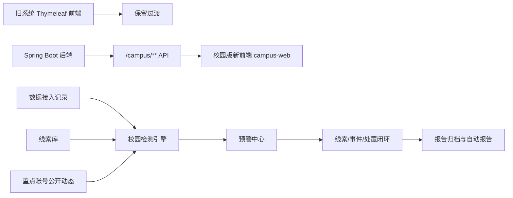
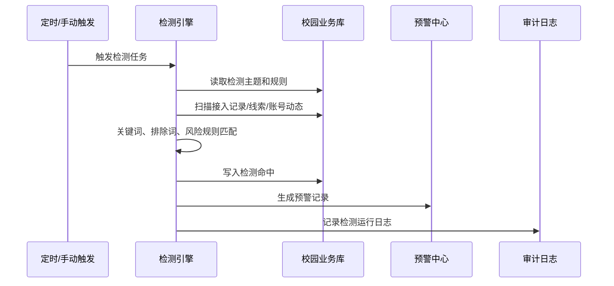

# 校园舆情系统新前端与检测能力实施方案

## 1. 背景与目标

当前系统后端已经完成校园舆情基础闭环，包括组织、字典、审计、线索、重点账号、事件处置、预警、报告、数据接入、辅助研判和自动报告。应用已经可以在云电脑本地运行，Flyway `V1.0` 到 `V1.9` 已验证迁移成功。

当前主要问题是前端仍然保留大量旧版通用舆情产品界面、菜单、文案和业务入口，不适合学校网信、宣传、学工、保卫、学院等部门日常使用。同时系统还缺少真正的“自动检测/监测”闭环，目前只有预警规则底座和手动检测接口。

本方案目标：

- 新建校园版前端，避免继续深改旧 Thymeleaf 页面。
- 补齐自动检测引擎，把接入数据、线索、重点账号动态自动扫描并生成预警。
- 保留旧前端作为过渡，不破坏原系统已有功能。
- 让新前端只围绕 `/campus/**` 新接口建设，形成校园业务闭环。
- 建立可由 Codex 主线程持续推进的模块化开发规范。

## 2. 总体路线

采用“后端稳定、前端新建、检测补强、逐步替换”的路线。



实施原则：

- 不在旧页面上继续大面积改皮肤。
- 新前端独立目录、独立路由、独立构建。
- 后端优先保持兼容，必要时补少量聚合接口。
- 检测能力先规则化、可解释，再接 AI 辅助研判。
- 所有涉及账号关注、数据接入、预警处置的操作保留审计。

## 3. 技术选型

### 3.1 前端

建议新建目录：

```text
campus-web/
```

技术栈：

- Vue 3
- Vite
- TypeScript
- Element Plus
- Pinia
- Vue Router
- Axios
- ECharts
- dayjs

选择理由：

- 后台管理系统开发效率高。
- Element Plus 适合学校业务系统，控件完整，学习成本低。
- TypeScript 有利于长期二开。
- 与后端分离，避免 Thymeleaf 页面和旧静态资源继续缠在一起。

### 3.2 后端

继续使用当前 Spring Boot 2.1.4 + MyBatis + Flyway。

短期保持 Java 8 兼容。后续可以独立规划升级 Spring Boot 和 JDK，但不和校园业务建设混在同一阶段。

### 3.3 本地开发

当前云电脑无 Docker，采用免安装本地环境：

- JDK 8：`.codex-tools/jdk8`
- MariaDB：`.codex-tools/mariadb`
- Redis：`.codex-tools/redis`
- 启动脚本：`scripts/dev/start-local.ps1`
- 停止脚本：`scripts/dev/stop-local.ps1`

## 4. 目标用户与权限视角

### 4.1 角色划分

第一阶段建议先按业务角色设计界面：

- 系统管理员：部门、字典、权限、审计。
- 网信办/宣传部：线索研判、预警处置、事件定级、报告归档。
- 学工/保卫/学院：接收处置任务、反馈处置结果、查看涉及本部门事件。
- 领导/值班人员：工作台、大屏、报告查看。
- 数据接入管理员：维护来源、任务、接入记录。

后端当前还没有完整 RBAC，需要在前端先按菜单规划，后端第二步补权限模型。

### 4.2 权限阶段策略

第一阶段：

- 复用现有登录。
- 新前端登录成功后使用现有 Cookie/Token。
- 菜单权限先配置化或前端静态角色模拟。

第二阶段：

- 新增校园角色、菜单、接口权限表。
- 后端对 `/campus/**` 做统一权限校验。
- 审计日志关联角色、部门、操作模块。

## 5. 新前端功能结构

### 5.1 一级菜单

```text
校园舆情工作台
线索库
重点关注账号
舆情事件
预警中心
检测任务
数据接入
辅助研判
报告归档
自动报告
系统设置
审计日志
```

### 5.2 页面清单

#### 工作台

目标：登录后第一屏看到“今天要处理什么”。

页面内容：

- 今日新增线索
- 待研判线索
- 待处理预警
- 处理中事件
- 超期处置任务
- 高风险事件
- 重点账号动态
- 最近检测命中

接口：

- `GET /campus/dashboard/overview`
- `GET /campus/dashboard/statistics`
- 后续补：`GET /campus/workbench/todo`

#### 线索库

页面：

- 线索列表
- 线索详情
- 新增/编辑线索
- 线索研判
- 线索归档
- 线索转事件
- 线索操作日志

接口：

- `/campus/clue/list`
- `/campus/clue/detail`
- `/campus/clue/save`
- `/campus/clue/judge`
- `/campus/clue/archive`
- `/campus/clue/delete`
- `/campus/clue/operation-logs`
- `/campus/event/create-from-clue`

#### 重点关注账号

页面：

- 账号列表
- 账号登记
- 账号审核
- 账号详情
- 关注任务
- 公开动态
- 到期提醒

合规字段必须显著展示：

- 来源依据
- 任务编号
- 授权范围
- 关注开始/结束时间
- 责任部门
- 审核状态
- 操作审计

接口：

- `/campus/account/list`
- `/campus/account/detail`
- `/campus/account/save`
- `/campus/account/audit`
- `/campus/account/update-status`
- `/campus/account/task/add`
- `/campus/account/task/list`
- `/campus/account/content/add`
- `/campus/account/content/list`

#### 舆情事件

页面：

- 事件列表
- 事件详情
- 事件定级
- 关联线索
- 关联重点账号
- 分派处置
- 部门反馈
- 退回补充
- 复核确认
- 事件归档

接口：

- `/campus/event/list`
- `/campus/event/detail`
- `/campus/event/save`
- `/campus/event/rate`
- `/campus/event/account/add`
- `/campus/event/assign`
- `/campus/event/feedback`
- `/campus/event/return`
- `/campus/event/confirm`
- `/campus/event/archive`
- `/campus/event/clue/list`
- `/campus/event/account/list`
- `/campus/event/task/list`
- `/campus/event/record/list`

#### 预警中心

页面：

- 预警列表
- 预警详情
- 预警处理/忽略
- 敏感词库
- 预警规则
- 手动检测线索
- 手动检测账号动态

接口：

- `/campus/alert/list`
- `/campus/alert/create`
- `/campus/alert/handle`
- `/campus/alert/evaluate-clue`
- `/campus/alert/evaluate-account-content`
- `/campus/alert/sensitive-word/list`
- `/campus/alert/sensitive-word/save`
- `/campus/alert/rule/list`
- `/campus/alert/rule/save`

#### 检测任务

这是下一步需要补的核心模块。

页面：

- 检测主题管理
- 检测规则配置
- 检测任务启停
- 检测运行日志
- 命中结果
- 一键转预警/线索

建议新增接口：

- `GET /campus/detection/topic/list`
- `POST /campus/detection/topic/save`
- `POST /campus/detection/topic/delete`
- `GET /campus/detection/task/list`
- `POST /campus/detection/task/save`
- `POST /campus/detection/task/update-status`
- `POST /campus/detection/task/run`
- `GET /campus/detection/hit/list`
- `GET /campus/detection/run-log/list`

#### 数据接入

页面：

- 来源管理
- 接入任务
- 标准化记录
- 运行日志
- 转线索
- 转重点账号动态

接口：

- `/campus/ingest/source/list`
- `/campus/ingest/source/save`
- `/campus/ingest/task/list`
- `/campus/ingest/task/save`
- `/campus/ingest/record/list`
- `/campus/ingest/record/submit`
- `/campus/ingest/record/convert-clue`
- `/campus/ingest/record/convert-account-content`
- `/campus/ingest/run/start`
- `/campus/ingest/run/finish`
- `/campus/ingest/run/list`

#### 辅助研判

页面：

- 创建分析任务
- 运行分析任务
- 分析结果列表
- 分析结果复核
- 采纳/驳回

接口：

- `/campus/analysis/task/create`
- `/campus/analysis/task/list`
- `/campus/analysis/task/run`
- `/campus/analysis/result/list`
- `/campus/analysis/result/review`

#### 报告归档

页面：

- 报告列表
- 报告详情
- 新建报告
- 报告模板
- 生成报告
- 归档报告
- 下载报告

接口：

- `/campus/report/list`
- `/campus/report/detail`
- `/campus/report/save`
- `/campus/report/generate`
- `/campus/report/archive`
- `/campus/report/download`
- `/campus/report/template/list`
- `/campus/report/template/save`

#### 自动报告

页面：

- 自动报告任务
- 手动运行
- 生成日志
- 生成结果跳转报告详情

接口：

- `/campus/auto-report/job/list`
- `/campus/auto-report/job/save`
- `/campus/auto-report/job/update-status`
- `/campus/auto-report/job/run`
- `/campus/auto-report/log/list`

#### 系统设置

页面：

- 部门管理
- 字典管理
- 审计日志
- 后续角色权限

接口：

- `/campus/department/**`
- `/campus/dict/**`
- `/campus/audit-log/**`

## 6. 检测引擎实施方案

### 6.1 检测对象

第一阶段检测三类对象：

- `campus_ingest_record`：接入但未转换的数据。
- `campus_clue`：已入库线索。
- `campus_account_content`：重点账号公开动态。

### 6.2 检测主题

建议新增表：

- `campus_detection_topic`
- `campus_detection_rule`
- `campus_detection_task`
- `campus_detection_hit`
- `campus_detection_run_log`

检测主题字段：

- 主题名称
- 主题分类
- 关键词
- 排除词
- 平台范围
- 数据来源范围
- 风险等级
- 责任部门
- 是否启用
- 备注

### 6.3 命中规则

规则类型：

- 包含关键词
- 全词匹配
- 正则匹配
- 多词同时出现
- 任意词出现
- 排除词过滤
- 风险等级过滤
- 重点账号动态过滤

### 6.4 运行流程



### 6.5 检测结果处理

命中后支持：

- 忽略
- 转预警
- 转线索
- 关联事件
- 进入辅助研判

### 6.6 检测与预警关系

检测负责“发现命中”，预警负责“业务处理”。

不要把检测命中直接等同于舆情事件。正确链路：

```text
检测命中 -> 预警 -> 人工研判 -> 线索/事件 -> 分派处置 -> 复核归档
```

## 7. 前端工程结构

建议目录：

```text
campus-web/
  src/
    api/
    assets/
    components/
    layouts/
    router/
    stores/
    styles/
    types/
    utils/
    views/
      dashboard/
      clue/
      account/
      event/
      alert/
      detection/
      ingest/
      analysis/
      report/
      auto-report/
      system/
```

接口封装：

```text
api/dashboard.ts
api/clue.ts
api/account.ts
api/event.ts
api/alert.ts
api/detection.ts
api/ingest.ts
api/analysis.ts
api/report.ts
api/system.ts
```

路由设计：

```text
/login
/dashboard
/clues
/accounts
/events
/alerts
/detection
/ingest
/analysis
/reports
/auto-reports
/system/departments
/system/dicts
/system/audit-logs
```

## 8. UI 设计原则

校园舆情系统应当是“安静、清晰、可追溯”的业务后台，不做营销风格首页。

界面风格：

- 主色使用政务/校园后台常见蓝色或深青色。
- 状态色统一：正常、关注、重大、紧急。
- 少用大面积渐变和装饰图。
- 页面优先信息密度和可扫描性。
- 所有表格支持筛选、分页、状态标签。
- 关键操作使用确认弹窗。
- 审计、来源依据、授权范围等字段不可隐藏在边角。

重点页面设计：

- 工作台：卡片 + 待办列表 + 风险趋势。
- 列表页：筛选区 + 表格 + 批量操作。
- 详情页：基础信息 + 流转记录 + 关联对象 + 审计记录。
- 处置页：时间线式流程。
- 大屏：第二阶段单独做，不塞进后台首页。

## 9. 阶段拆分

### 阶段 A：前端地基

目标：新前端能登录、能请求接口、能进入校园后台框架。

任务：

- 初始化 `campus-web`。
- 配置 Vite、TypeScript、Element Plus、Router、Pinia、Axios。
- 登录页改校园版。
- 主布局、侧边菜单、顶部用户区。
- 请求拦截、登录过期处理。
- 字典缓存。

验收：

- 能访问新前端。
- 能登录。
- 能进入工作台。
- 接口错误统一提示。

### 阶段 B：核心闭环页面

目标：完成线索、账号、事件、预警四个主业务模块。

任务：

- 工作台。
- 线索库。
- 重点关注账号。
- 舆情事件。
- 预警中心。

验收：

- 可录入线索。
- 可线索转事件。
- 可分派处置。
- 可反馈、复核、归档。
- 可配置敏感词并检测线索。

### 阶段 C：检测引擎

目标：补齐自动发现问题能力。

任务：

- 新增检测表。
- 新增检测后端接口。
- 新增检测引擎服务。
- 新增检测任务页面。
- 检测命中自动生成预警。

验收：

- 创建检测主题。
- 提交接入记录。
- 运行检测任务。
- 生成检测命中。
- 自动生成待处理预警。

### 阶段 D：数据接入、分析、报告

目标：让系统具备日常运行、复盘和汇报能力。

任务：

- 数据接入页面。
- 辅助研判页面。
- 报告归档页面。
- 自动报告页面。

验收：

- 可维护接入来源。
- 可转线索或账号动态。
- 可运行辅助研判。
- 可生成并下载报告。

### 阶段 E：权限、审计、验收优化

目标：达到学校试运行要求。

任务：

- 校园角色权限。
- 菜单权限。
- 接口权限。
- 审计日志补全。
- 操作手册。
- 演示数据。

验收：

- 不同角色看到不同菜单。
- 关键操作全部有审计。
- 能按学校流程完整演示。

### 阶段 F：校园态势大屏

目标：做展示和领导驾驶舱。

任务：

- 今日舆情态势。
- 风险趋势。
- 部门处置进度。
- 高频关键词。
- 重点账号动态。
- 预警地图或院系分布。

验收：

- 大屏能自动刷新。
- 数据来自真实业务表。
- 不影响后台业务操作。

## 10. 开发批次建议

在现有 Batch 0-10 后继续：

- Batch 11：校园检测引擎后端。
- Batch 12：新前端工程初始化。
- Batch 13：前端工作台与系统设置。
- Batch 14：前端线索库与重点账号。
- Batch 15：前端事件处置与预警中心。
- Batch 16：前端检测任务与数据接入。
- Batch 17：前端辅助研判、报告、自动报告。
- Batch 18：权限模型、菜单权限、接口权限。
- Batch 19：校园态势大屏。
- Batch 20：联调、演示数据、验收文档、部署脚本。

当前执行状态：

- Batch 11-20 已完成。
- 当前进入试运行准备和现场二开阶段。

## 11. 接口补强清单

当前已有接口能支撑大部分页面，但为了前端体验，建议补以下聚合接口：

- `GET /campus/workbench/todo`
- `GET /campus/workbench/recent-alerts`
- `GET /campus/workbench/recent-events`
- `GET /campus/event/timeline`
- `GET /campus/account/expire-reminders`
- `GET /campus/clue/options`
- `GET /campus/system/current-user`
- `GET /campus/system/menu-tree`
- `GET /campus/detection/dashboard`

## 12. 数据与演示准备

需要准备演示数据：

- 校级部门：网信办、宣传部、学工部、保卫处、学院。
- 字典：风险等级、事件状态、处置状态、平台、来源类型。
- 线索样例：食堂、宿舍、考试、校园安全、网络谣言。
- 重点账号样例：必须使用模拟账号，不使用真实学生隐私账号。
- 检测主题样例：校园安全、食堂服务、宿舍管理、涉校谣言。
- 报告模板：日报、周报、事件专报。

演示账号仅用于本地开发协调，不写入交付材料。试运行账号由学校管理员初始化发放，并要求首次登录改密。

## 13. 合规边界

必须坚持：

- 只处理公开、授权、上级移交、学校业务中依法获得的数据。
- 不绕过平台访问限制。
- 不采集私信、通讯录、密码、定位、非公开个人信息。
- 不以技术手段识别学生私人账号。
- 重点关注账号必须具备来源依据、任务编号、授权范围、关注期限、审核记录。
- AI 研判结果只能作为辅助建议，不能自动形成最终结论。

## 14. 验收标准

### 14.1 功能验收

- 线索能从录入到研判、转事件、归档。
- 重点账号能登记、审核、记录公开动态。
- 事件能定级、分派、反馈、复核、归档。
- 检测任务能自动扫描并生成预警。
- 预警能处理或忽略。
- 报告能生成、下载、归档。
- 审计日志能查询关键操作。

### 14.2 技术验收

- 后端 `mvnw -DskipTests package` 成功。
- 前端 `npm run build` 成功。
- Flyway 全部迁移成功。
- 新前端主要页面无控制台错误。
- 关键接口错误有统一提示。
- 本地启动脚本可重复执行。

### 14.3 演示验收

必须能演示一条完整链路：

```text
接入记录 -> 检测命中 -> 自动预警 -> 人工研判 -> 转事件 -> 分派处置 -> 部门反馈 -> 复核归档 -> 生成报告
```

## 15. 风险与对策

风险：旧系统权限和新校园业务权限不一致。

对策：第一阶段前端菜单先独立，第二阶段补后端权限。

风险：继续沿用旧前端导致改造成本失控。

对策：新建 `campus-web`，旧前端只保留过渡。

风险：检测规则误报过多。

对策：检测命中先进入预警，必须人工研判，不直接升级事件。

风险：学校试运行时需要演示真实流程。

对策：提前准备校园场景演示数据和操作手册。

风险：云电脑无 Docker。

对策：沿用免安装 JDK、MariaDB、Redis 方案。

## 16. 下一步建议

建议立即进入 Batch 11：校园检测引擎后端。

原因：

- 新前端需要检测任务页面，但后端检测接口还没有。
- 补完检测引擎后，系统业务链路会真正变成“自动发现 + 人工处置”。
- 前端开发时可以直接围绕完整闭环做页面，而不是先做空壳。

Batch 11 完成后，再启动 Batch 12 新前端工程初始化。
