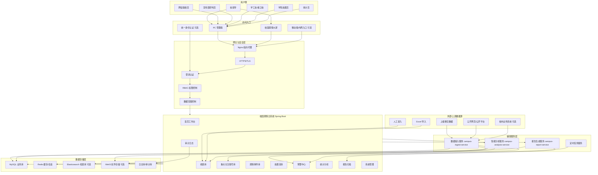
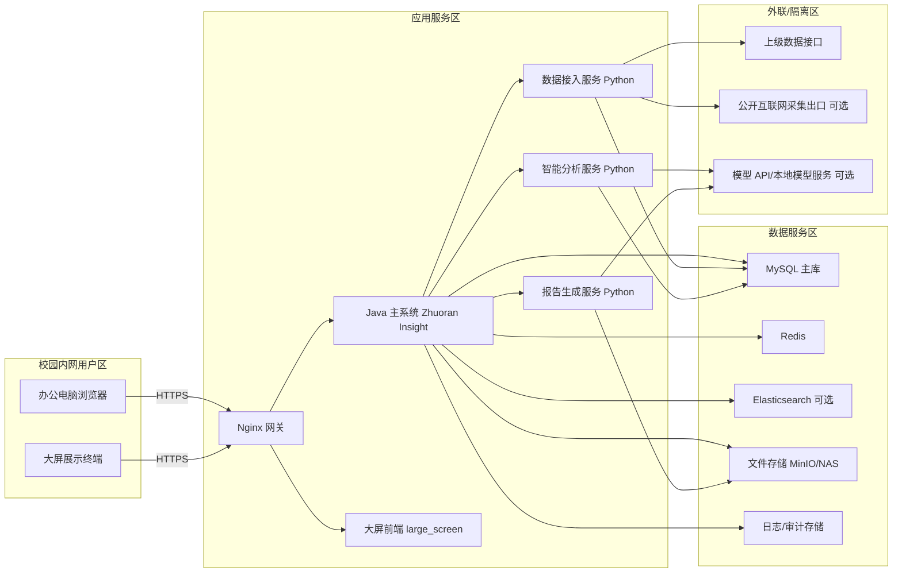
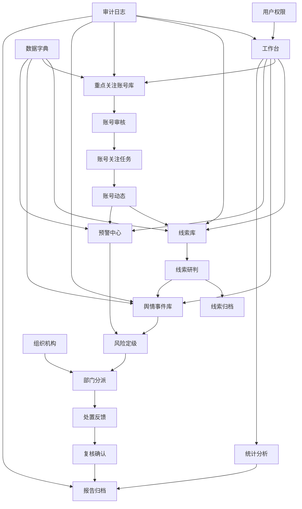
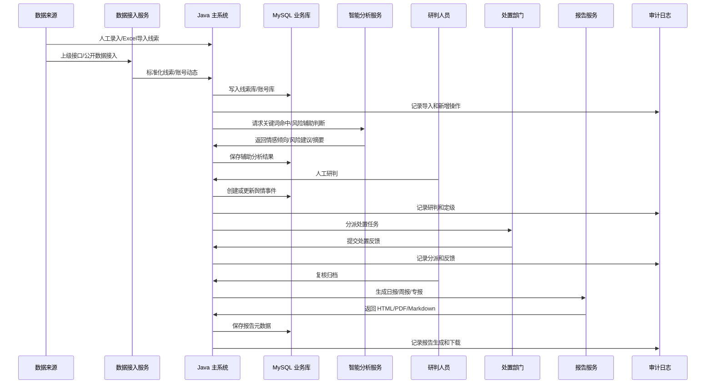
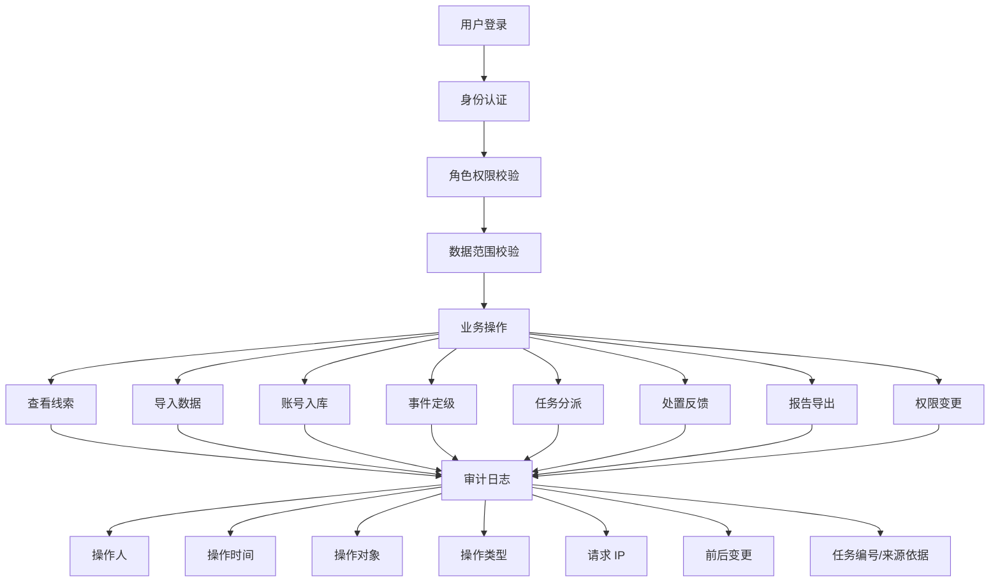
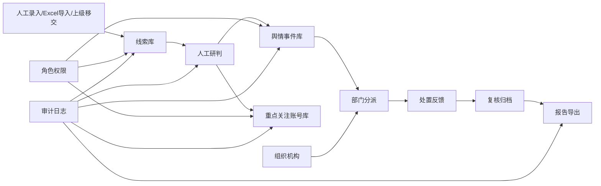
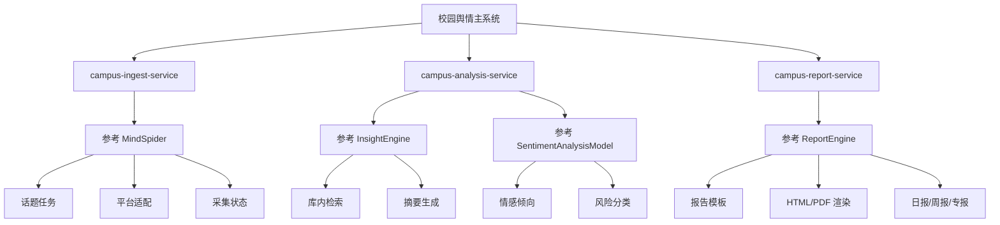

# 校园舆情系统架构拓扑

## 1. 总体架构拓扑

## 2. 部署拓扑

## 3. 业务模块拓扑

## 4. 数据流拓扑

## 5. 安全与审计拓扑

## 6. 第一阶段 MVP 拓扑

第一阶段建议只建设如下闭环：

## 7. 第二阶段增强拓扑

第二阶段再接入 BettaFish 思路：

## 8. 拓扑落地建议

- 主业务系统优先部署在校园内网应用区。
- 数据库、Redis、审计库放在数据服务区，禁止公网直接访问。
- 数据接入服务如需访问外网，建议放在外联隔离区或通过受控代理出口。
- 智能分析和报告服务可以先内网部署，后期再决定是否接入外部模型 API。
- 所有敏感操作必须走 Java 主系统统一鉴权和审计。
- 大屏只读展示，不承载新增、删除、导出等高风险操作。
