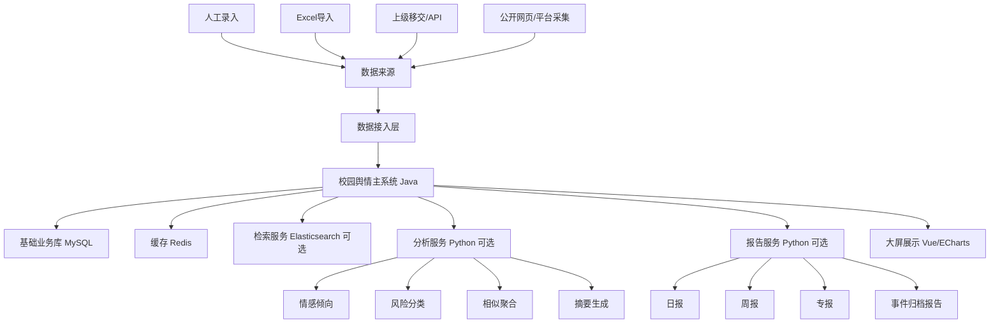
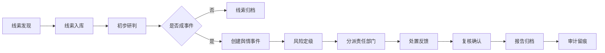

# 校园舆情系统二次开发实施方案

配套架构拓扑见：[校园舆情系统架构拓扑](campus-yuqing-architecture-topology.md)。

Codex 全流程开发治理规范见：[Codex 全流程开发治理规范](codex-development-governance.md)。

具体开发批次拆分见：[校园舆情系统 Codex 开发拆分清单](codex-development-work-breakdown.md)。

## 1. 项目目标

基于当前卓然舆情主线建设一套适合学校场景使用的校园网络舆情系统，用于支撑学校网信、宣传、学工、保卫、学院等部门开展舆情线索管理、重点账号关注、事件研判、任务处置、报告归档和审计留痕。

系统第一阶段以“基础业务闭环”为核心，不优先堆叠爬虫、大模型和大屏效果。待线索库、账号库、事件库、权限审计、处置流程稳定后，再逐步引入公开数据采集、智能分析和自动报告能力。

## 2. 建设原则

### 2.1 合规可审计

- 仅处理公开信息、上级移交信息、学校授权登记信息、业务部门依法依规提供的信息。
- 重点账号功能命名为“重点关注账号”或“风险账号关注”，避免设计成无边界的“学生账号监控”。
- 账号入库必须记录来源依据、任务编号、授权范围、关注期限、经办人和审核人。
- 所有查看、导入、研判、分派、处置、导出、删除操作必须进入审计日志。

### 2.2 先闭环再智能

先完成组织、权限、线索、账号、事件、处置、报告、审计等基础能力，再接入采集服务、情感分析、模型研判、智能报告。

### 2.3 主系统稳定，外围服务解耦

保留现有 Java/Spring Boot 系统作为主业务门户。采集、模型分析、报告生成等 Python 能力以独立服务接入，不直接把 BettaFish 整体塞进 Java 项目。

### 2.4 人工研判优先

系统自动识别结果只作为辅助建议，风险等级、事件定性、处置结论必须支持人工确认、复核和追溯。

## 3. 总体架构



推荐部署结构：

- 卓然舆情主系统：负责用户、权限、业务流程、页面、审计。
- `large_screen`：大屏展示，保留并改造成校园指标。
- `campus-ingest-service`：数据接入服务，后期参考 BettaFish `MindSpider`。
- `campus-analysis-service`：分析服务，后期参考 BettaFish `InsightEngine` 和 `SentimentAnalysisModel`。
- `campus-report-service`：报告服务，后期参考 BettaFish `ReportEngine`。

## 4. 核心业务流程



事件状态建议：

- `待研判`
- `已定级`
- `已分派`
- `处理中`
- `已反馈`
- `已复核`
- `已归档`

风险等级建议：

- `一般关注`
- `较大风险`
- `重大风险`
- `紧急事件`

## 5. 功能模块设计

### 5.1 系统基础模块

#### 5.1.1 组织机构

支持学校、校区、学院、部门、年级、班级等组织层级。

核心能力：

- 组织树维护
- 部门负责人配置
- 部门处置范围配置
- 数据查看范围控制

建议表：

- `campus_department`

#### 5.1.2 用户与权限

建议角色：

- 系统管理员
- 网信联络员
- 宣传部研判员
- 学工处人员
- 保卫处人员
- 学院处置员
- 校领导
- 审计员

核心权限：

- 菜单权限
- 数据范围权限
- 操作权限
- 导出权限
- 审计查看权限

### 5.2 数据字典模块

统一维护系统基础分类。

建议字典：

- 线索来源
- 平台类型
- 风险等级
- 舆情类型
- 事件状态
- 处置状态
- 账号类型
- 账号关注级别
- 敏感词类别
- 报告类型

### 5.3 线索库模块

线索库是第一阶段最重要的业务入口。

核心能力：

- 人工新增线索
- Excel 批量导入
- 上级移交线索登记
- API 接入线索
- 线索查重
- 线索合并
- 线索转事件
- 线索归档
- 附件上传
- 操作记录

建议字段：

- 线索标题
- 线索内容
- 来源平台
- 原文链接
- 发布时间
- 发现时间
- 涉及部门
- 涉及账号
- 关键词命中
- 初判风险等级
- 研判结论
- 当前状态
- 创建人
- 审核人

建议表：

- `campus_clue`
- `campus_clue_attachment`
- `campus_clue_operation_log`

### 5.4 重点关注账号库

该模块用于管理经授权、经确认、需要阶段性关注的公开账号或业务对象。

核心能力：

- 账号登记
- 来源依据登记
- 关注期限设置
- 责任部门绑定
- 关注级别设置
- 账号标签
- 账号关联事件
- 账号动态记录
- 到期提醒
- 审核入库
- 取消关注

建议字段：

- 平台
- 昵称
- 账号 ID
- 主页链接
- 账号类型
- 关联人员或组织，按权限脱敏展示
- 来源依据
- 任务编号
- 授权范围
- 关注开始时间
- 关注结束时间
- 关注级别
- 责任人
- 审核人
- 状态

建议表：

- `campus_account`
- `campus_account_relation`
- `campus_account_task`
- `campus_account_content`

边界要求：

- 不做密码、私信、通讯录、非公开内容采集。
- 不做绕过平台限制、破解登录、批量撞库等能力。
- 不做无依据的自动识别学生私人账号。
- 只对公开动态、授权数据、上级移交线索进行登记和研判。

### 5.5 舆情事件模块

事件是线索流转后的核心处置对象。

核心能力：

- 由线索创建事件
- 多线索合并为事件
- 事件风险定级
- 事件画像
- 关联账号
- 关联部门
- 处置任务分派
- 处置反馈
- 复核归档
- 事件报告生成

建议字段：

- 事件标题
- 事件类型
- 事件摘要
- 首发时间
- 发现时间
- 风险等级
- 影响范围
- 涉及部门
- 涉及账号
- 当前热度
- 当前状态
- 处置要求
- 归档结论

建议表：

- `campus_event`
- `campus_event_clue`
- `campus_event_content`
- `campus_event_account`

### 5.6 处置流转模块

核心能力：

- 部门分派
- 办理时限
- 催办提醒
- 处置反馈
- 附件上传
- 退回重办
- 复核确认
- 超期统计

建议表：

- `campus_disposal_task`
- `campus_disposal_record`
- `campus_disposal_attachment`

### 5.7 预警规则模块

第一阶段以规则为主，后续再叠加模型。

规则类型：

- 敏感词命中
- 重点账号发布
- 同类线索短时间聚集
- 负面情绪占比升高
- 高风险平台来源
- 事件热度增长
- 上级移交标记

建议表：

- `campus_sensitive_word`
- `campus_alert_rule`
- `campus_alert`

### 5.8 统计分析模块

第一阶段做可解释的统计。

页面指标：

- 今日新增线索数
- 待研判线索数
- 进行中事件数
- 高风险事件数
- 超期处置任务数
- 平台来源分布
- 部门分布
- 风险等级分布
- 舆情趋势
- 重点账号动态数量

### 5.9 报告模块

报告类型：

- 每日舆情简报
- 每周舆情周报
- 重大事件专报
- 事件处置归档报告
- 重点账号阶段性观察报告

第一阶段：

- Java 模板生成 Word/HTML/PDF
- 支持人工编辑摘要和结论

第二阶段：

- 参考 BettaFish `ReportEngine`
- 由 Python 报告服务生成结构化 HTML/PDF
- Java 主系统负责审核、归档、下载和审计

### 5.10 审计日志模块

必须记录：

- 登录
- 查看敏感数据
- 新增/修改/删除
- 导入/导出
- 账号入库/取消关注
- 事件定级
- 任务分派
- 处置反馈
- 报告生成/下载
- 权限变更

建议表：

- `campus_audit_log`

## 6. 数据库实施建议

第一批优先建表：

```text
campus_department
campus_dict_type
campus_dict_item
campus_user_data_scope
campus_clue
campus_clue_attachment
campus_account
campus_account_task
campus_account_content
campus_event
campus_event_clue
campus_disposal_task
campus_disposal_record
campus_sensitive_word
campus_alert_rule
campus_alert
campus_audit_log
```

与现有系统集成方式：

- 使用 Flyway 新增迁移脚本。
- 使用 MyBatis XML 延续现有项目风格。
- 页面优先沿用现有 Thymeleaf 管理端。
- 大屏部分继续使用 `large_screen` 的 Vue/ECharts。

## 7. 接口设计建议

### 7.1 线索接口

- `POST /campus/clue/create`
- `POST /campus/clue/import`
- `GET /campus/clue/list`
- `GET /campus/clue/detail`
- `POST /campus/clue/judge`
- `POST /campus/clue/archive`
- `POST /campus/clue/convert-event`

### 7.2 重点账号接口

- `POST /campus/account/create`
- `POST /campus/account/audit`
- `GET /campus/account/list`
- `GET /campus/account/detail`
- `POST /campus/account/update-status`
- `POST /campus/account/add-task`
- `GET /campus/account/content-list`

### 7.3 事件接口

- `POST /campus/event/create`
- `GET /campus/event/list`
- `GET /campus/event/detail`
- `POST /campus/event/risk-level`
- `POST /campus/event/assign`
- `POST /campus/event/archive`

### 7.4 处置接口

- `GET /campus/disposal/task-list`
- `POST /campus/disposal/feedback`
- `POST /campus/disposal/return`
- `POST /campus/disposal/confirm`

### 7.5 报告接口

- `POST /campus/report/daily`
- `POST /campus/report/weekly`
- `POST /campus/report/event`
- `GET /campus/report/list`
- `GET /campus/report/download`

## 8. BettaFish 借鉴落地方式

### 8.1 MindSpider

借鉴内容：

- `daily_topics`
- `crawling_tasks`
- 平台适配器
- 关键词驱动采集
- 任务状态统计

落地方式：

- 不直接把 MindSpider 放进 Java 项目。
- 独立改造成 `campus-ingest-service`。
- 输入来自系统内关键词、事件、重点账号任务。
- 输出写入 `campus_account_content`、`campus_clue` 或中间采集表。
- 数据范围限定为公开数据、授权接口、上级指定来源。

### 8.2 ReportEngine

借鉴内容：

- 报告模板
- 章节生成
- HTML/PDF 渲染
- 图表块

落地方式：

- 独立改造成 `campus-report-service`。
- Java 传入事件、线索、统计图表数据。
- Python 返回 HTML/PDF/Markdown。
- Java 负责审核、归档和下载审计。

### 8.3 InsightEngine

借鉴内容：

- 私有数据库检索
- 线索聚合摘要
- 问答式查询

落地方式：

- 只开放只读视图。
- 查询范围受当前用户权限约束。
- 生成内容标注“AI 辅助，仅供研判参考”。

### 8.4 SentimentAnalysisModel

借鉴内容：

- 情感倾向识别
- 风险分类模型训练思路

落地方式：

- 第一阶段用规则。
- 第二阶段积累人工标注样本。
- 第三阶段训练校园场景分类模型。

## 9. 阶段计划

### 阶段 0：现有系统梳理与安全整改

周期：1 周

任务：

- 梳理现有登录、权限、菜单、数据访问方式。
- 替换默认账号和默认密码。
- 替换 JWT、数据库、Redis 等密钥。
- 修复 API Token 判空逻辑。
- 收紧静态文件映射。
- 增加 Cookie 安全属性。
- 确认 Java、Maven、MySQL、Redis、前端构建环境。

交付物：

- 本地可运行环境
- 安全整改清单
- 基础配置说明

### 阶段 1：基础数据和权限体系

周期：2 周

任务：

- 组织机构管理
- 用户角色权限
- 数据字典
- 数据范围控制
- 审计日志框架

交付物：

- 组织管理页面
- 角色权限页面
- 字典管理页面
- 审计日志基础表和拦截器

### 阶段 2：线索库和重点账号库

周期：3 周

任务：

- 线索新增、导入、列表、详情、研判、归档
- 重点账号新增、审核、关注期限、任务编号、动态记录
- 线索和账号关联
- 基础查询和统计

交付物：

- 线索库模块
- 重点关注账号库模块
- Excel 导入模板
- 审计记录覆盖关键操作

### 阶段 3：事件流转和处置闭环

周期：3 周

任务：

- 线索转事件
- 多线索合并事件
- 风险定级
- 部门分派
- 处置反馈
- 复核归档
- 超期提醒

交付物：

- 舆情事件模块
- 处置任务模块
- 事件全流程记录
- 事件归档报告初版

### 阶段 4：预警规则和统计大屏

周期：2 周

任务：

- 敏感词维护
- 规则配置
- 预警列表
- 趋势统计
- 平台分布
- 部门处置统计
- 大屏指标改造

交付物：

- 预警中心
- 统计分析页面
- 校园舆情大屏初版

### 阶段 5：数据接入服务

周期：3-4 周

任务：

- 人工/API/Excel 接入标准化
- 对接上级移交数据接口，如有
- 参考 MindSpider 设计采集任务表
- 公开数据采集任务服务
- 采集结果去重、清洗、入库

交付物：

- 数据接入服务
- 采集任务中心
- 数据清洗规则
- 接入日志和失败重试机制

### 阶段 6：智能分析与报告

周期：3-5 周

任务：

- 情感倾向辅助判断
- 相似线索聚合
- 事件摘要生成
- 报告模板管理
- 日报、周报、专报生成
- 报告审核和归档

交付物：

- 分析服务
- 报告服务
- 报告模板库
- AI 辅助研判说明和人工复核机制

## 10. 里程碑计划

推荐总周期：10-16 周。

```text
第 1 周：系统跑通、安全整改、详细设计
第 2-3 周：组织、权限、字典、审计
第 4-6 周：线索库、重点账号库
第 7-9 周：事件流转、处置闭环
第 10-11 周：预警规则、统计分析、大屏
第 12-14 周：数据接入服务
第 15-16 周：智能分析、报告生成、验收优化
```

如果时间紧，MVP 可压缩为 6-8 周，只做：

- 组织权限
- 线索库
- 重点账号库
- 事件流转
- 处置反馈
- 审计日志
- 基础统计

## 11. 验收标准

### 11.1 功能验收

- 能完成线索从发现到归档的完整闭环。
- 能登记和审核重点关注账号。
- 能创建事件并分派给部门处置。
- 能查看事件全过程记录。
- 能生成日报、周报或事件报告。
- 能按角色控制数据范围。
- 能查看关键操作审计日志。

### 11.2 安全验收

- 默认账号和默认密钥已全部替换。
- 敏感操作进入审计日志。
- 导出操作有权限控制和日志。
- 不暴露数据库、Redis、模型服务密钥。
- 文件访问路径受控。
- 账号关注有来源依据和期限。

### 11.3 性能验收

- 常用列表分页查询响应稳定。
- 线索和事件检索支持索引。
- 导入任务支持异步处理。
- 大屏接口不影响主业务操作。

## 12. 风险与应对

### 12.1 合规风险

风险：账号关注边界不清，容易被理解为无限制监控。

应对：

- 设置来源依据、任务编号、期限、审核、审计。
- 只处理公开信息和授权数据。
- 敏感字段脱敏展示。

### 12.2 采集稳定性风险

风险：平台反爬、登录失效、接口变化。

应对：

- 第一阶段不依赖爬虫。
- 采集服务独立部署。
- 支持手工导入和上级接口作为主入口。

### 12.3 模型误判风险

风险：AI 误判导致处置偏差。

应对：

- AI 结果只作为辅助。
- 风险定级必须人工确认。
- 保留模型输入、输出和人工修改记录。

### 12.4 项目范围膨胀风险

风险：同时做大屏、爬虫、模型、报告，导致基础业务延期。

应对：

- 第一阶段只做闭环。
- 后续能力按服务拆分。
- 每阶段独立验收。

## 13. 第一批开发任务清单

建议立即启动以下任务：

1. 新增 `campus_*` 表结构设计和 Flyway 脚本。
2. 做组织机构、字典、审计日志基础能力。
3. 做线索库 CRUD、导入、研判、归档。
4. 做重点关注账号库，包含来源依据、任务编号、关注期限。
5. 做事件创建、分派、处置反馈、归档。
6. 做基础统计接口。
7. 改造大屏指标为校园场景。
8. 安全整改默认账号、密钥、Cookie、文件映射和 Token 判空。

## 14. 推荐实施结论

当前项目应按“校园舆情业务系统”方向改造，而不是先做“爬虫平台”或“多 Agent 平台”。

第一优先级是补齐：

- 线索库
- 重点关注账号库
- 舆情事件库
- 处置流程
- 权限体系
- 审计日志
- 报告归档

BettaFish 的价值在第二阶段体现：

- `MindSpider` 用于参考采集任务架构。
- `ReportEngine` 用于参考自动报告。
- `InsightEngine` 用于参考库内智能检索。
- `SentimentAnalysisModel` 用于参考情感和风险分类。

这样做的好处是：前期能快速交付学校真正能用的闭环系统，后期再稳步增强自动采集、智能研判和报告生成能力。
