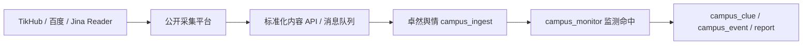

# 公开采集平台新项目蓝图

> 适用场景：从现有“卓然舆情”项目之外重新开一个独立采集平台，用低成本、可审计、可控合规的方式沉淀公开网络内容，再向舆情业务系统输出标准化数据。

## 1. 项目定位

新项目不应定位为“万能社媒爬虫”或“替代 TikHub 的黑盒采集器”，而应定位为：

**公开信源采集平台 + 社媒补充适配器 + 合规采集治理中心。**

核心目标：

- 降低百度 API、TikHub 等第三方 API 的持续调用成本。
- 建立自有公开网页内容库和全文索引，避免每次用户检索都实时外呼。
- 对学校官网、政府网站、新闻媒体、公告、RSS、站点地图、贴吧、B站、知乎、微信公众号文章页等可公开访问内容进行稳定采集。
- 对抖音、小红书、快手等高风控平台继续保留 TikHub/API 兜底，不把高风险采集内置为默认能力。
- 为现有卓然舆情项目输出统一、可追溯、可去重的接入记录。

## 2. 与现有卓然舆情项目的关系

现有项目 `D:\PRJ\yuqing` 已有 `campus_ingest`、`campus_monitor`、`campus_clue` 等模块，新采集平台建议作为独立服务存在。

推荐关系：



新平台负责“采集、解析、去重、索引、合规审计”；现有舆情系统负责“监测规则、线索、预警、研判、报告、权限展示”。

建议对接方式：

- 第一阶段：新平台提供 `HTTP Push API`，由卓然舆情接收标准化内容。
- 第二阶段：增加 MQ，例如 Kafka/RabbitMQ/Redis Stream，用于高频增量内容。
- 第三阶段：卓然舆情只拉取命中监测主体的内容，降低业务库压力。

## 3. 需要对接的平台分层

### 3.1 自建主力来源

这些来源应该成为新项目的核心低成本数据底座：

| 来源 | 默认技术路径 | 入库策略 |
|---|---|---|
| 学校官网 | 栏目页、站点地图、RSS、公开页面抓取 | 可保留全文 |
| 政府网站 | 栏目页、公开公告、政策发布页 | 可保留全文 |
| 新闻媒体 | 百度发现 + 站点栏目 + RSS | 标题、摘要、URL、发布时间；授权/白名单后保留全文 |
| 本地媒体 | 信源库 + 定时采集 | 可重点采集 |
| 行业网站 | 白名单栏目 + 关键词规则 | 可按客户配置 |
| 贴吧公开帖 | 公开页面/搜索发现 | 标题、正文摘要、链接、楼主昵称，评论默认关闭 |
| 公开论坛 | 白名单栏目 + 公开详情页 | 默认摘要，重点来源可全文 |

### 3.2 可自建但要限量的平台

这些平台可以做非登录态公开页面采集，但不要做大规模站内替代。

| 平台 | 建议路径 | TikHub/API 角色 |
|---|---|---|
| B站 | 公开视频页、UP 主页、百度发现、B站公开搜索页轻量发现 | 兜底搜索/互动数补全 |
| 知乎 | 百度发现 `zhihu.com/question`、`zhuanlan.zhihu.com`，公开详情页抽取 | 少量兜底 |
| 微博 | 百度发现真实帖子 URL，`m.weibo.cn/detail/{id}` / `weibo.com/{uid}/{id}` 详情抽取 | 危机事件、宽搜、详情失败兜底 |
| 微信公众号 | 搜索发现 `mp.weixin.qq.com/s/...`，文章页抽取，重点公众号白名单 | 公众号站内搜索补洞 |

### 3.3 不建议自建主通道的平台

这些平台非登录态采集可行性低，风控和合规风险高，不建议新项目把它们作为自建主通道：

| 平台 | 原因 | 建议 |
|---|---|---|
| 抖音 | Web 签名、风控、登录态、验证码、内容结构变化频繁 | 继续 TikHub/API，做预算控制 |
| 小红书 | 签名、登录态、xsec_token、风控强，评论/用户数据风险高 | 继续 TikHub/API，重点内容才拉详情 |
| 快手 | GraphQL/REST 接口、登录态和风控风险 | 继续 TikHub/API，必要时只做重点账号 |

## 4. 技术架构设想

### 4.1 模块划分

| 模块 | 职责 |
|---|---|
| Source Registry | 管理信源、平台、域名、栏目、白名单、频率、合规等级 |
| Discovery | 通过百度、Bing、站点地图、RSS、栏目页、重点账号发现 URL |
| Scheduler | 按信源等级、预算、频率、失败退避调度采集任务 |
| Fetcher | 执行 HTTP 抓取、必要时无登录 Playwright 渲染 |
| Extractor | 抽取标题、正文、作者、发布时间、互动数、结构化元数据 |
| Normalizer | 统一字段、清洗 HTML、高亮标签、控制字符、时间格式 |
| Dedup | URL 去重、内容 hash、SimHash/MinHash 近似去重 |
| Indexer | 建全文索引和按平台/时间/主体的检索索引 |
| Compliance Guard | robots、白名单、频率、个人信息脱敏、审计、删除请求 |
| Connector | 向卓然舆情或其他业务系统推送标准化内容 |
| Fallback API | 管理 TikHub、百度、Jina Reader 等第三方增强调用 |

### 4.2 推荐技术栈

后端：

- Java/Spring Boot 或 Python/FastAPI 均可。
- 如果团队要和卓然舆情现有 Java 技术栈一致，建议 Spring Boot。
- 如果重点是采集和解析效率，建议 Python/FastAPI + Playwright/httpx/selectolax/readability-lxml。

存储：

- PostgreSQL 或 MySQL：信源、任务、内容元数据、审计日志。
- Elasticsearch/OpenSearch：全文检索。
- Redis：任务锁、去重缓存、限频桶、失败退避。
- 对象存储：必要时保存截图、原始 HTML 快照摘要或归档文件。

采集运行：

- HTTP 优先，Playwright 仅用于公开页面渲染失败场景。
- 不默认使用账号、Cookie、代理池、验证码绕过、逆向签名。
- 所有外呼都必须进入调用日志和成本统计。

## 5. 采集模式设计

### 5.1 非登录态 HTTP 采集

默认模式。

适合：

- 新闻页
- 学校官网
- 政府公告
- RSS
- 站点地图
- 公众号公开文章页
- B站公开视频页
- 知乎公开文章/回答页

要求：

- 固定、透明的 User-Agent。
- 严格限频。
- 自动退避。
- 遵守白名单和 robots 评估结果。
- 不访问登录后 API。

### 5.2 无登录浏览器渲染

仅用于公开页面需要 JS 渲染时。

允许：

- 打开公开 URL。
- 等待首屏或正文节点。
- 提取 DOM 文本。

禁止：

- 使用个人账号登录。
- 保存或注入 Cookie。
- 绕验证码。
- 连接真实用户浏览器规避风控。
- 调用需要签名/登录态的私有 API。

### 5.3 第三方 API 兜底

TikHub、百度、Jina Reader 的角色应从“主数据源”降级为“发现、补洞、增强”。

建议规则：

- 百度：公开网页 URL 发现，不作为最终内容库。
- Jina Reader：公开 URL 正文提取增强，只读白名单 URL。
- TikHub：抖音/小红书/快手主通道；微博/B站/知乎/公众号仅兜底。

## 6. 合规边界

### 6.1 明确禁止

- 登录态采集、账号池、Cookie 池。
- 绕过验证码、滑块、人机校验。
- 逆向签名或复制平台私有签名逻辑用于生产。
- 使用代理池大规模规避平台访问限制。
- 批量采集评论、用户主页、粉丝关系、互动关系。
- 采集手机号、身份证、住址、精确定位、学生证号、未成年人敏感信息。
- 将平台内容完整搬运成替代站点。

### 6.2 默认最小化入库

默认保存：

- 标题
- 摘要或正文片段
- 原文 URL
- 来源名称
- 平台
- 作者昵称
- 发布时间
- 采集时间
- 命中关键词
- 风险标签
- 内容 hash

谨慎保存：

- 全文
- 评论
- 头像
- 用户主页
- 精确互动数

默认不保存：

- 个人联系方式
- 身份证件信息
- 精确住址
- 精确定位
- 未成年人敏感资料
- 私域或登录后内容

### 6.3 审计字段

每条内容建议记录：

```json
{
  "source_url": "...",
  "source_domain": "...",
  "platform": "...",
  "fetch_method": "http|browser|baidu_discovery|tikhub|jina_reader",
  "capture_time": "...",
  "robots_policy": "allow|disallow|unknown|manual_approved",
  "source_license_level": "public|whitelist|restricted|unknown",
  "content_capture_status": "full|partial|metadata_only|failed",
  "raw_snapshot_hash": "...",
  "pii_sanitized": true
}
```

## 7. 对接卓然舆情的数据契约

新平台输出字段建议兼容现有 `CampusIngestItem` 语义。

```json
{
  "platform": "bilibili",
  "sourcePlatform": "bilibili",
  "sourceName": "B站",
  "externalId": "BVxxxx",
  "originalUrl": "https://www.bilibili.com/video/BVxxxx",
  "title": "标题",
  "content": "正文或摘要",
  "authorName": "作者昵称",
  "publishTime": "2026-05-17T10:00:00+08:00",
  "contentType": "video|article|post|news|notice",
  "keywords": "新疆大学,投诉",
  "likeCount": 0,
  "commentCount": 0,
  "shareCount": 0,
  "collectCount": 0,
  "viewCount": 0,
  "contentCaptureStatus": "full|partial|metadata_only|failed",
  "rawData": "{}"
}
```

对接策略：

- 新平台先做内容标准化和去重，再推给卓然舆情。
- 卓然舆情仍按监测任务规则二次命中，不允许宽泛采集直接变线索。
- 对同一 `platform + externalId` 或 `canonicalUrl` 做幂等写入。
- 非 `http/https` 原文链接不推送。
- 评论默认不推送，除非事件升级并人工开启。

## 8. 参考项目：MediaCrawler

参考仓库：

- GitHub：`https://github.com/NanmiCoder/MediaCrawler`
- 本地临时检查路径：`C:\Users\qjw\AppData\Local\Temp\mediacrawler_inspect`
- 本次检查 commit：`f328ee3`

### 8.1 可借鉴内容

- 多平台目录结构：`media_platform/{platform}/client.py/core.py/login.py/field.py`。
- 平台适配器思想：平台 Client 负责接口请求，Core 负责任务流程，Store 负责落库。
- 任务类型拆分：关键词搜索、指定帖子详情、创作者主页。
- 数据输出模式：json/jsonl/csv/db/sqlite/postgres 等。
- 抓取条数、评论开关、二级评论开关、并发、休眠等配置化设计。
- B站、微博、知乎等平台公开 URL/公开接口字段结构可作为研究参考。

### 8.2 不建议复用内容

- 不能直接复制源码或嵌入项目：许可证是 `NON-COMMERCIAL LEARNING LICENSE 1.1`，限定非商业学习研究。
- 不建议使用登录态 Cookie、扫码登录、真实浏览器 CDP 反检测。
- 不建议复用小红书、抖音、快手的签名/风控绕行逻辑。
- 不建议默认开启评论和二级评论采集。
- 不建议引入代理池作为生产能力。

### 8.3 对本项目的启发

MediaCrawler 说明 TikHub 或同类数据服务背后很可能也是“浏览器上下文 + 平台 Web API + 签名/登录态 + 代理/限频”的采集工程体系。自建平台可以学习其工程抽象，但应主动收敛到更合规的公开采集路线：

- HTTP 优先。
- 白名单优先。
- 非登录态优先。
- 内容最小化。
- 评论默认关闭。
- 第三方高风险平台继续外包给 TikHub/API。

## 9. MVP 路线图

### P0：公开网页采集底座

目标：先把最稳、最低风险、最能降成本的部分做出来。

- 信源库：域名、栏目、RSS、站点地图、白名单、频率、合规等级。
- HTTP Fetcher：标题、正文、发布时间、作者、URL、来源抽取。
- 百度发现：只发现 URL，发现后进入自有库。
- Jina Reader：作为公开 URL 正文增强，可开关和限额。
- 去重：URL canonical、内容 hash、近似重复。
- 输出：HTTP Push 到卓然舆情测试环境。

### P1：B站、知乎、公众号文章页

目标：替代一部分 TikHub 宽搜。

- B站公开视频详情抽取。
- B站重点 UP 新视频发现。
- 知乎问题/回答/专栏文章页抽取。
- 公众号 `mp.weixin.qq.com/s/...` 文章页抽取。
- 每个平台都要有单独限频和失败退避。

### P2：微博真实帖子 URL 抽取

目标：把微博从 TikHub 默认宽搜降为 TikHub 兜底。

- 百度发现真实微博帖子 URL。
- 只接收 `weibo.com/{uid}/{postId}` 和 `m.weibo.cn/detail/{postId}`。
- 抽取失败时可调用 TikHub 详情兜底。
- 不采账号资料卡、话题页、搜索页。

### P3：成本治理和预算调度

目标：把外部 API 成本变成可审计、可控制。

- 每次外部调用写调用日志。
- 记录 endpoint、关键词、返回条数、有效条数、重复条数、估算成本。
- 任务级日限额、平台级日限额、客户级日限额。
- 危机模式：人工开启后提高频率和 TikHub 兜底比例。

### P4：高级能力

在 P0-P3 稳定后再考虑：

- 重点账号增量监控。
- URL 级截图留证。
- 内容变更检测。
- 多语言内容抽取。
- 向量检索和事件聚类。

## 10. 风险与决策建议

### 10.1 技术风险

- 平台页面结构变化会导致抽取失败。
- 非登录态社媒采集召回有限。
- 浏览器渲染成本高，不适合大规模默认使用。
- 搜索引擎发现可能有延迟。

### 10.2 合规风险

- 平台条款可能限制自动化访问。
- 评论、用户资料、互动关系属于高风险数据。
- 全文存储可能涉及著作权和内容替代风险。
- 学校场景可能涉及学生个人信息和未成年人信息。

### 10.3 推荐决策

- 新项目第一版只做 P0 + 部分 P1。
- 抖音、小红书、快手继续 TikHub，不在第一版自建。
- 先用自建平台替代新闻/网页/B站/知乎/公众号文章页的一部分成本。
- 微博放到 P2，且只做真实帖子 URL 级抽取。
- 所有高风险能力必须默认关闭，通过人工配置和审计开启。

## 11. 一句话总结

新项目应该做成“可控、可审计、低成本的公开内容采集平台”，而不是“复刻 MediaCrawler/TikHub 的全平台登录态爬虫”。真正能长期降低成本的是公开信源库、自建索引、去重缓存和预算调度；抖音、小红书、快手这类高风险平台继续用 TikHub 兜底更稳。
